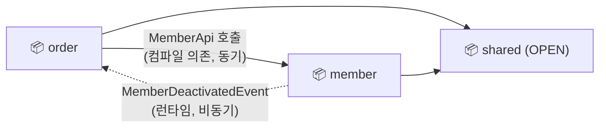
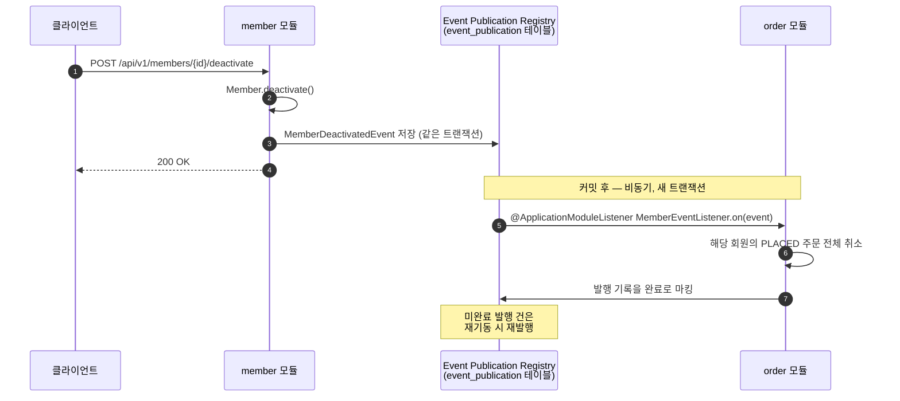

<div align="center">

# Kotlin Spring Modulith Template

**Kotlin, Spring Boot, Spring Modulith로 만든 프로덕션 지향 모듈러 모놀리스 템플릿**

[](https://github.com/hyunolike/kotlin-spring-modulith-template/actions/workflows/ci.yml)
[](https://kotlinlang.org)
[](https://spring.io/projects/spring-boot)
[](https://spring.io/projects/spring-modulith)
[](https://openjdk.org/projects/jdk/21/)
[](https://www.postgresql.org)
[](LICENSE)

[English](README.md) | **한국어**

</div>

---

<table>
<tr>
<td width="38%" align="center">

</td>
<td width="62%" valign="top">
패키지 경계가 곧 모듈 경계이며, 이 규칙은 테스트로 강제됩니다.
모듈 간 통신은 파사드 인터페이스(동기)와 도메인 이벤트(비동기)로만 허용되어,
모놀리스의 단순함을 유지하면서 마이크로서비스 수준의 경계를 얻을 수 있습니다.
</td>
</tr>
</table>


## 목차

- [주요 기능](#주요-기능)
- [시작하기](#시작하기)
- [프로젝트 구조](#프로젝트-구조)
- [모듈 간 통신](#모듈-간-통신)
- [새 모듈 추가하기](#새-모듈-추가하기)
- [테스트](#테스트)
- [설정 프로파일](#설정-프로파일)
- [기여하기](#기여하기)
- [라이선스](#라이선스)
- [참고 자료](#참고-자료)

## 주요 기능

- 🧱 **강제되는 모듈 경계** — `ApplicationModules.verify()`가 경계 위반·순환 의존을 빌드 실패로 잡아냄
- 🚦 **기동 시 검증** — 애플리케이션 부팅 시에도 동일한 모듈 검증 실행(`spring-modulith-runtime`); 경계가 깨진 아키텍처는 런타임에 도달하지 못함
- 🔄 **두 가지 통신 패턴 기본 제공** — 동기 파사드 호출과 비동기 도메인 이벤트를 실제 동작하는 `member`/`order` 모듈로 시연
- 📬 **신뢰할 수 있는 이벤트** — Event Publication Registry가 모든 이벤트를 `event_publication` 테이블에 기록하고, 미완료 이벤트를 재기동 시 재발행
- 🧪 **모듈 단위 테스트** — `@ApplicationModuleTest`로 모듈 하나만 부트스트랩, `Scenario` DSL로 이벤트 흐름 검증, Testcontainers PostgreSQL 사용
- 📐 **살아있는 아키텍처 문서** — Modulith `Documenter`가 코드에서 C4/PlantUML 다이어그램과 모듈 캔버스를 자동 생성
- 🛡️ **일관된 API 계층** — 전역 예외 처리, 통일된 `ApiResponse<T>` 응답 포맷, 요청 ID(MDC) 로깅, Swagger UI
- 🧹 **코드 품질 게이트** — ktlint, detekt 빌드 통합
- 🐳 **설정 없는 로컬 실행** — `compose.yaml` + spring-boot-docker-compose로 PostgreSQL 자동 기동

## 시작하기

### 사전 요구사항

- Docker (로컬 PostgreSQL 및 Testcontainers용)
- JDK 21 — 없으면 Gradle 툴체인이 자동 다운로드

### 실행

```bash
./gradlew bootRun
```

`compose.yaml`의 PostgreSQL이 자동으로 시작됩니다. 이후 접속:

- Swagger UI: http://localhost:8080/swagger-ui.html
- 헬스 체크: http://localhost:8080/actuator/health

### API 사용해보기

```bash
# 회원 등록
curl -X POST localhost:8080/api/v1/members \
  -H 'Content-Type: application/json' \
  -d '{"name":"홍길동","email":"hong@example.com"}'

# 주문 생성 (order 모듈이 MemberApi로 회원을 검증)
curl -X POST localhost:8080/api/v1/orders \
  -H 'Content-Type: application/json' \
  -d '{"memberId":1,"productName":"키보드","amount":120000}'

# 회원 탈퇴 → MemberDeactivatedEvent → 주문이 비동기로 취소됨
curl -X POST localhost:8080/api/v1/members/1/deactivate
curl "localhost:8080/api/v1/orders?memberId=1"   # status: CANCELLED
```

## 프로젝트 구조

```
com.template
├── TemplateApplication.kt     # 루트: 전역 인프라 설정 (@EnableAsync, @EnableJpaAuditing)
├── shared/                    # 공유 모듈 (OPEN) — 공통 응답, 예외, 설정
│   ├── response/              #   ApiResponse, ErrorResponse
│   ├── error/                 #   ErrorCode, BusinessException, GlobalExceptionHandler
│   ├── domain/                #   BaseTimeEntity (JPA Auditing)
│   └── config/                #   OpenAPI 설정, MDC 로깅 필터
├── member/                    # 회원 모듈
│   ├── MemberApi.kt           #   파사드 인터페이스        (공개)
│   ├── MemberInfo.kt          #   공개 DTO                (공개)
│   ├── MemberStatus.kt        #   공개 enum               (공개)
│   ├── MemberDeactivatedEvent.kt  # 도메인 이벤트          (공개)
│   ├── application/           #   유스케이스               (은닉)
│   ├── domain/                #   엔티티, 리포지토리        (은닉)
│   └── presentation/          #   컨트롤러, DTO           (은닉)
└── order/                     # 주문 모듈 (member에 단방향 의존)
    ├── OrderInfo.kt / OrderStatus.kt
    ├── application/           #   OrderService, MemberEventListener
    ├── domain/
    └── presentation/
```

각 모듈은 **루트 패키지만 다른 모듈에 노출**됩니다 (파사드 인터페이스, 공개 DTO,
이벤트). `application` / `domain` / `presentation` 하위 패키지는 Spring Modulith
기본 규칙으로 은닉되며, 다른 모듈에서 import하면 `ModularityTests`가 실패합니다.

## 모듈 간 통신

| 패턴 | 방법 | 이 템플릿의 예시 |
|---|---|---|
| 동기 호출 | 상대 모듈 루트의 파사드 인터페이스 | `OrderService` → `MemberApi.getMember()` |
| 비동기 통지 | 도메인 이벤트 + `@ApplicationModuleListener` | `MemberDeactivatedEvent` → order 모듈이 해당 회원 주문 취소 |

컴파일 의존은 한 방향으로만 향하고, 비즈니스 흐름은 런타임에 이벤트로 되돌아옵니다:



> **핵심 규칙:** 이벤트 소비자는 발행자의 이벤트 타입에 컴파일 의존합니다.
> 순환을 피하려면 동기 호출과 이벤트 소비가 **같은 방향**이어야 합니다 —
> 이 템플릿에서는 엄격하게 `order → member` 단방향입니다.

이벤트는 Event Publication Registry(`event_publication` 테이블)에 저장됩니다.
리스너가 실패하면 미완료 기록이 남고, `republish-outstanding-events-on-restart=true`
설정으로 다음 기동 시 재발행됩니다:



## 새 모듈 추가하기

1. `com.template.<모듈명>` 패키지 생성
2. 모듈 루트에는 공개 계약만 배치: 파사드 인터페이스, 공개 DTO, 이벤트
3. 구현은 `application` / `domain` / `presentation` 하위 패키지에 배치
4. 다른 모듈 접근은 파사드 호출 또는 이벤트 수신으로만 — 순환 의존 금지
5. `@ApplicationModuleTest` 모듈 테스트 작성 (의존 모듈 파사드는 `@MockitoBean`으로 대체)
6. `./gradlew test --tests "com.template.ModularityTests"` 로 경계 검증

## 테스트

```bash
./gradlew test                 # 전체 테스트 (Testcontainers가 PostgreSQL 기동)
./gradlew ktlintCheck detekt   # 린트 & 정적 분석
./gradlew ktlintFormat         # 자동 포맷
```

- `ModularityTests` — 모듈 경계를 검증하고 아키텍처 문서(C4/PlantUML + 모듈
  캔버스)를 `build/spring-modulith-docs/`에 생성
- `MemberModuleTests` / `OrderModuleTests` — `Scenario` DSL로 이벤트 발행·소비를
  검증하는 모듈 단위 테스트

## 설정 프로파일

| 프로파일 | 데이터베이스 | DDL | 비고 |
|---|---|---|---|
| default (local) | docker compose 자동 기동 | `update` | Swagger UI, SQL 로깅 활성화 |
| `prod` | `DB_URL` / `DB_USERNAME` / `DB_PASSWORD` 환경변수 | `validate` | 마이그레이션 도구(Flyway 등) 사용 권장 |

## 기여하기

기여를 환영합니다! 버그 리포트, 기능 제안, PR 모두 이 템플릿을 더 좋게
만드는 데 도움이 됩니다.

1. **Fork** 후 `main`에서 브랜치를 생성합니다

   ```bash
   git checkout -b feat/amazing-feature
   ```

2. **변경 작업** — 모듈 경계 규칙을 지켜주세요
   (전체 컨벤션은 [AGENTS.md](AGENTS.md) 참고)

3. PR을 열기 전에 **검증**이 통과하는지 확인합니다

   ```bash
   ./gradlew clean build   # 테스트 + ktlint + detekt + 모듈 경계 검증
   ```

4. [Conventional Commits](https://www.conventionalcommits.org) 형식으로 **커밋**합니다

   ```
   feat: add payment module
   fix: handle duplicate email on registration
   docs: clarify event direction rule
   ```

5. 무엇을, 왜 변경했는지 명확히 적어 **Pull Request**를 엽니다

규모가 있는 변경이라면 시간을 들이기 전에 먼저 이슈를 열어 방향을
논의해주세요.

## 라이선스

이 프로젝트는 [MIT License](LICENSE)로 배포됩니다.

## 참고 자료

- [Spring Modulith 공식 레퍼런스](https://docs.spring.io/spring-modulith/reference/)
- [카카오뱅크 — 레거시에서 모듈러 모놀리스로](https://tech.kakaobank.com/posts/2507-legacy-to-modular-monolith-with-spring-modulith/)
- [team-dodn/spring-boot-kotlin-template](https://github.com/team-dodn/spring-boot-kotlin-template)
